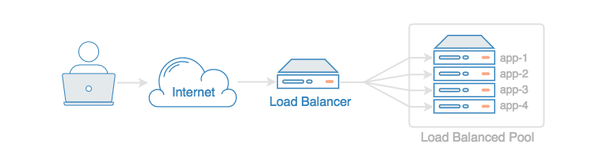

# Improving Scalability and Performance of Servers

Scalability is the capability of dynamically, or easily, adapting to increased load without impacting existing performance.

The performance which is measured by High Availability (HA) is the capability of a site to remain available and accessible even during the failure of one or more systems.
 

## Can LoadBalancers help improve?

* Load Balancers allow us to split incoming traffic between multiple backend servers. Often this is used to distribute HTTP requests among a group of application servers to increase overall capacity. This is a common way to scale applications.

* They can increase availability by performing repeated health checks on our backend servers and automatically removing failed servers from the pool.
By default, the Load Balancer will fetch a web page every few seconds to make sure the server is responding properly. If this fails multiple times in a row, the server will be removed until the problem is resolved.

* They can help to deploy our new software on production infrastructure, test it thoroughly, then switch traffic over to it only after verifying that everything is working as expected. If the deployment ends up failing in new and unexpected ways, we can easily recover by switching the Load Balancer back to the old version.

##### Whether it’s for high availability or leveraging various deployment techniques, Load Balancers are a flexible and powerful tool in production infrastructure.

## Vertical vs. Horizontal Scaling

The difference is the approach to adding computing resources to infrastructure.
With vertical scaling (a.k.a. “scaling up”), we would be adding more power to our existing machine. In horizontal scaling (a.k.a. “scaling out”), we can get the additional resources into our system by adding more machines to our network, sharing the processing and memory workload across multiple devices.
  
## Why Horizontal Scaling is better than Vertical Scaling

- We don’t get caught in a resource deficit in horizontal scaling. Instead of taking our server offline while we’re scaling up to a better one, it lets us keep our existing pool of computing resources online while adding more to what we already have. 

- While vertical scaling can be quite expensive and can be done only a finite number of times, horizontal scaling can be more frequent as and when needed to size or resize the system according to our needs.
##### When scaled horizontally a system has an added benefit of Elasticity.

### Conclusion
 Horizontal scaling or scale dynamically is quite easy as we can add more machines into the existing pool. Vertical scaling on the contrary is often limited to the capacity of a single machine. Scaling beyond that capacity results in downtime and comes with an upper limit.
 Some good examples of horizontal scaling are Cassandra, MongoDB and that of vertical scaling is MySQL and Amazon RDS.
 If we need to achieve superior performance issues we can use either vertical scaling or horizontal scaling or both in cloud environments.

### References
 
 * [Load Balancing](https://devcentral.f5.com/s/articles/what-is-load-balancing-24740)
 * [Load Balancing Use Cases](https://www.digitalocean.com/community/tutorials/5-digitalocean-load-balancer-use-cases)
 * [Horizontal vs Vertical Scaling](https://www.missioncloud.com/blog/horizontal-vs-vertical-scaling-which-is-right-for-your-app)
 * [Illustration of difference between vertical and horizontal scaling](https://www.geeksforgeeks.org/system-design-horizontal-and-vertical-scaling/)

